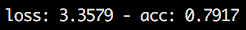
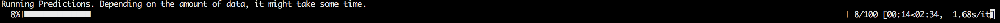

# Grab Safety Challenge

## Work Done
In this challenge, I tried to train two state of the art Deep Learning models for classifying sequential data.

The models trained are:
- Vanilla LSTM Model: This model was trained to get a benchmark for the kind of accuracy a normal model would get.
- CNN LSTM Model: This model was implemented and trained. It consists of Time distributed LSTM layers followed by normal LSTM layers. The model achieves an accuracy of 72%. You can read more about the model from [here](https://ieeexplore.ieee.org/document/7178838)
- ConvLSTM Model: This model combines both CNN and LSTM layers together. Predictions are done using Dense layers after the ConvLSTM layers. This model achieves accuracy of 79%. You can find out more about the model from [here](https://arxiv.org/abs/1506.04214v1).

## Results

You can see the model visualisation of the model trained [here](images/model.png)

The model achieves an accuracy of 79%. You can see the results [here](images/training.png)

### Installation
The repository requires python3.6 to run. You can then install the packages required, using:

```bash
pip install -r requirements.txt
```

### Training the Models
You can train the models using the following commands:

```bash
python model.py --model CONV_LSTM --save_to models/conv_lstm.h5 --epochs 5
```
Here, the arguments do the following:
- --model: The model you want to train. There are three models you can train: LSTM, CNN_LSTM and CONV_LSTM. Choose one of those values. Default: LSTM
- --save_to: Path to save your model to.
- --epochs: The number of epochs to train for. Default = 1

<br/>

### Testing your trained models
You can test your models by using the following command:

```bash
python test_model.py --model_path models/conv_lstm.py --data_folder data/features --label_folder data/labels
```

The arguments do the following:
- --model_path: Path to the model you want to test
- --data_folder: Path to the directory containing your data file
- --label_folder: Path to the directory containing the labels for your data

<br/>
